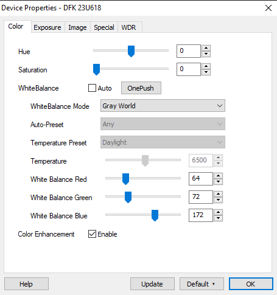
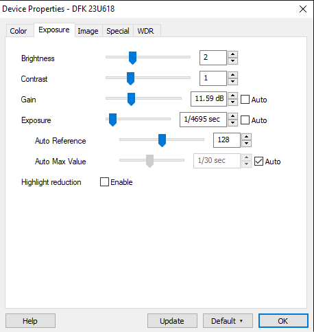
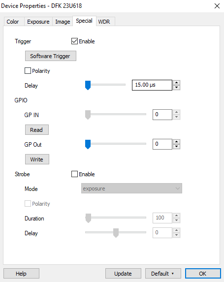

User's Guide
============

Hardware Overview
*****************

The system consists of:

- Motor Power Supply
- Heater Power Supply (GW INSTEK GPD-X303S)
- Control PC
- XY Translation Stage
- Heating elements (nozzle and bed)
- Microfab nozzles
- MicroFab JetDrive III
- Imaging setup (not documented here)

Connections
***********

Before beginning any experiment, ensure that the following connections are made:

- USB cables from both uSteppers to the PC
- Power from the motor PSU (24V) to the two motor controllers
- Power from the LED PSU (12V) to the Phlatlight LED driver
- USB cable from the GPD-4303S heater power supply to the PC
- Nozzle and bed heating elements to the heater PSU with banana plugs
- Thermocouples inside the nozzle and bed heatblocks
- RS-232 cable from the JetDrive III
- USB 3.0 cable from the camera to the PC

.. warning::
  It is crucial that the thermocouples are properly attached to the heating blocks. Without temperature sensors the system cannot regulate its own temperature and may engage in a thermal runaway.

Turning on the system
********************

In order:

#. Power on the controlling computer and log in
#. Power on the heater power supply (GW INSTEK GPD-X303S)

  * The power supply should say USB YES on its front panel.
  * Do not touch any controls on the front panel of the power supply.

#. Power on the motor power supply at the wall
#. Power on the LED power supply at the wall
#. Start the main software by running XY_commander.py 

  * This can be achieved either via VS Code or from the PRINTING.bat file on the desktop.

#. Open IC Capture 2.4 (link on desktop)
#. Open JetServer 4 (link on desktop)

Configuring IC Capture 2.4
**************************

.. warning::
  It is very important that you use IC Capture 2.4 - version 2.5 seems to be unable to enable the trigger on the camera.

#. If it does not automatically open, open the correct usb camera (DFK 23U618).
#. Right click the image and click 'Properties', and ensure the following settings are correctly set:

Configuring JetServer
*********************

JetServer tends to take care of itself - if you know how to use it then for the most part you should be fine.
The most important thing is to set the trigger mode to 'External' so that bespoke-ijp can control it.

Using the GUI
*************

GUI is in progress - this section is very subject to change!

Trigger Configuration
---------------------

Heater Control
--------------
